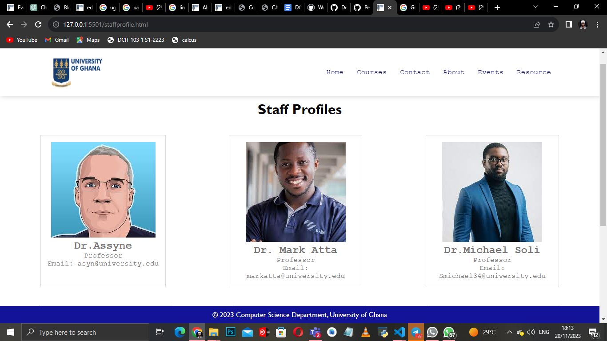

# NAME :DENNIS YEBOAH 
# STUDENT ID: 11352458 

# Computer Science Department. 

Welcome to the Computer Science Department website! This platform serves as a centralized hub for information and resources related to the department. The website includes various pages such as Home, Events, Contact, Courses, Resources, Learn More, Staff Profiles, and About. Whether you're a student, faculty member, or visitor, you'll find valuable information to stay connected and informed.

### Home page

The home page is the main page of the website. It contains the department's mission statement, departmental events, and departmental news.

### About page
The About page contains information about the department, including the mission statement, history, and departmental goals. The About Page provides general information about the Computer Science Department. It may include the department's mission, vision, history, and any relevant accreditation. This page serves as a reference point for anyone seeking a broad understanding of the department's goals and values.

By providing detailed information on each page, users can navigate the website more effectively and find the specific information they are looking for within the Computer Science Department.

### Courses page
The Courses page contains information about the department's courses, including the course catalog, course descriptions, and course prerequisites.

The Course Page is a comprehensive resource for students to access information about the courses offered by the department. Each course entry includes the course name, description, syllabus, and schedule. It may also provide links to relevant course materials and online resources.

### Events page
The Events page contains information about the department's events, including the department's upcoming events and past events. he Events Page lists upcoming and past events hosted by the Computer Science Department. Each event entry includes details such as the event name, date, time, venue, and a brief description. Users can find information on guest speakers, workshops, and any other activities related to the department.

### Resources page
The Resources page contains links to the department's online resources, including the department's online course catalog, departmental policies, and departmental forms.The Resource Page acts as a centralized hub for additional learning materials, links, and resources related to computer science. This could include recommended books, online tutorials, coding exercises, and other tools that support the learning objectives of the department.

### Learn More page
The Learn More page contains links to the department's online resources, including the department's online course catalog, departmental policies, and departmental forms.

### Staff Profiles page
The Staff Profiles page contains information about the department's faculty and staff members.The Staff Profile Page showcases profiles of faculty and staff members within the Computer Science Department. Each profile includes the staff member's name, position, area of expertise, educational background, and contact information. This page helps students and visitors get to know the people behind the department.

### Contact page
The Contact page contains information about contacting the department. The Contact Page contains contact information for various department members, including faculty, staff, and administrative personnel. It may include email addresses, phone numbers, and office locations. A contact form might also be provided for general inquiries or feedback.

### Blog page
The Blog page contains the department's blog posts.
The Blog Page is a platform for sharing articles, insights, and updates related to computer science and technology. It serves as a dynamic space where faculty, students, and guest contributors can publish posts on various topics. Each blog post includes a title, publication date, author, and the main content.

### Catalog  page
The Catalog Page is a centralized resource that provides an organized list of all the courses offered by the Computer Science Department. This page serves as a comprehensive catalog or directory, offering detailed information about each course, including prerequisites, credits, and course descriptions.

### SCREENSHOTS OF EACH PAGE

### Courses page screenshot

### Contact page screenshot

### About page screenshot

### Event page screenshot

### Resources page screenshot

### Learn-More page screenshot

### Catalog page screenshot

### StaffProfile page screenshot

### Blog page screenshot

### Lessons Learned:
Through this project, I gained valuable experience in using HTML, CSS, and JavaScript to create a dynamic and informative website. I learned the importance of organizing information effectively, creating a user-friendly interface, and maintaining a consistent design across different pages. Additionally, working on this project improved my collaboration and version control skills through the use of Git. Overall, this project has enhanced my web development skills and provided practical insights into creating functional websites for specific purposes.

